<div align="center">

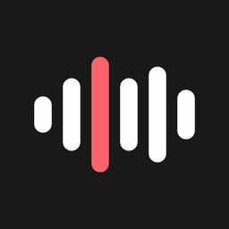

# Yapper

**Free, private voice-to-text keyboard for iPhone.**<br>
Talk, and Yapper types it into any app. Speech is transcribed on your iPhone, never on a server.

[](LICENSE)
[](#install)
[](#tech)
[](#privacy)
[](https://github.com/justingluska/yapper/actions/workflows/build.yml)

Coming soon to the App Store · [Privacy](https://goldpenguin.org/yapper/privacy/) · [Support](https://goldpenguin.org/yapper/support/)

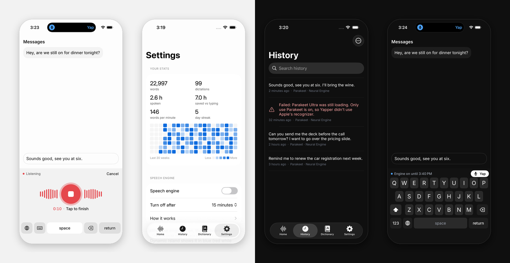

</div>

## The promise

I built Yapper for myself, because I wanted to talk instead of type without handing my voice to a server, and I'm
sharing it with anyone else who does too. It will stay this way:

- **Free, forever.** No price, no subscription, no "pro" tier, no word limits. Yapper will never charge you.
- **Nothing collected, ever.** No account, no sign-up, no email, no analytics, no ads, no tracking, no crash reports.
  There is no Yapper server, so there is nowhere for your voice or your words to go.
- **Works anywhere.** After the one-time model download, Yapper needs no internet at all: airplane mode, a cabin with
  no signal, the middle of the desert.
- **Nothing required from you.** No login and no phone number. It asks for the microphone, Speech Recognition only if
  you pick Apple's recognizer, and Full Access only so the keyboard can hand your words to the Yapper app on your
  phone.
- **Open source.** MIT licensed, so you don't have to take any of this on trust: read the code, or build it yourself.

— Justin Gluska ([@gluska](https://x.com/gluska))

## Why Yapper

Voice typing is faster than thumbs, but most dictation apps send your voice to a server, ask for an account, and
cap how much you can say before you pay. Yapper does none of that.

- **On-device.** Speech is turned into text on your iPhone's Neural Engine. Audio and text never leave the phone.
- **Free, no limits.** No subscription, no word cap, no account, no "pro" tier.
- **No tracking.** No analytics, no ads, no crash reporting, no server.
- **Works offline.** After a one-time model download, Yapper works in airplane mode.
- **Open source.** MIT licensed, so anyone can check every claim above.

| | Yapper (on-device) | Typical cloud dictation |
|---|---|---|
| Where speech is transcribed | On your iPhone | On the provider's servers |
| Account | None | Usually required |
| Limits | None | Often a weekly word cap on the free tier |
| Price | Free | Often a monthly subscription |
| Works offline | Yes, after the model download | No |
| Can you read the code | Yes, MIT | Usually not |

## Features

**Keyboard**
- One big mic: tap anywhere to talk, tap again to finish, and the text is typed where your cursor is
- A full typing layout too, so the keyboard is useful even without Full Access
- Undo the last dictation with one tap

**Clean text**
- Removes "um", "uh", "er" and stutters ("I I think"), each switchable
- Personal dictionary: "when I say X, write Y" for names, brands and jargon

**Speech engines, all on the device**
- **Parakeet Ultra** (most accurate, 632 MB download) or **Parakeet v3** (480 MB), on the Neural Engine
- **Apple on-device** recognizer: built in, nothing to download, less accurate
- Every dictation records which engine transcribed it, and why

**History and stats**
- Search and copy every dictation, including the ones that failed, so nothing you say is lost
- Recordings kept for 1 day by default (Don't keep up to Forever), to play back or transcribe again
- Totals, streak, words per minute and a contribution grid

**Start it your way**
- Dynamic Island and Lock Screen Live Activity: blue when ready, red while listening, amber while it types, with a
  button to turn the mic off
- Control Center control, Action Button, Back Tap, Siri ("Yap with Yapper") and Shortcuts ("Start Dictating")
- Optional: copy every dictation to the clipboard (this iPhone only)

<p align="center">
  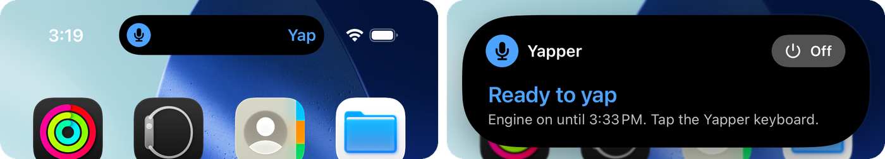
</p>

<p align="center">
  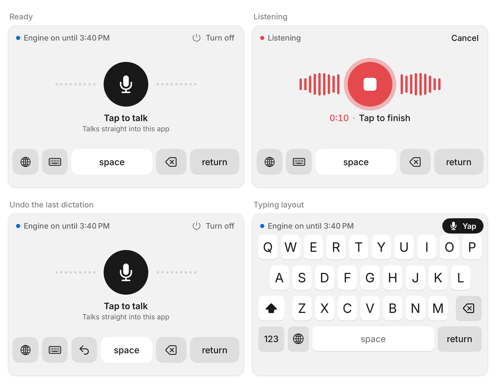
</p>

## How it works

iOS doesn't let keyboards use the microphone, so Yapper has two halves:

1. **The Yapper app** records and transcribes. It runs Parakeet through
   [FluidAudio](https://github.com/FluidInference/FluidAudio) on the Neural Engine, or Apple's recognizer forced to run
   on the device.
2. **The Yapper keyboard** is a remote control and a text inserter. It never touches audio and has no network code.

The first time you tap the mic, the keyboard opens the app, which starts listening straight away. Swipe right along
the bottom edge to go back. The speech engine then stays on for the time you choose (5, 15 or 60 minutes; 15 by
default), so every dictation after that happens right in the keyboard, without leaving your app.

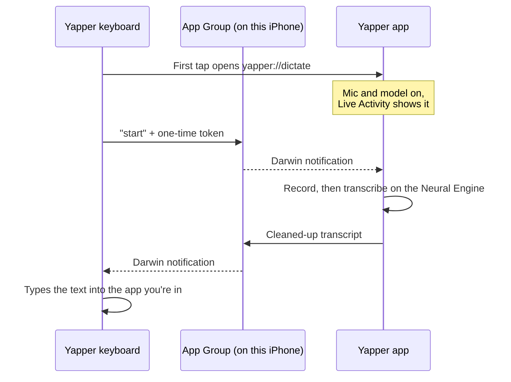

The two halves share a private App Group on the device: settings and state in shared `UserDefaults`, and Darwin
notifications as signals (they carry no data). That shared folder is why the keyboard needs **Full Access**. Each
command carries a one-time token so no other app can start or stop a dictation. The details are in
[`Shared/Common/Bridge.swift`](Shared/Common/Bridge.swift).

## Privacy

Yapper collects nothing. There is no account, no analytics SDK, no crash reporter and no server. The App Store
privacy label is "Data Not Collected".

- **Audio** is recorded only while you dictate and transcribed on your iPhone. Recordings are kept on the device for
  1 day by default, excluded from iCloud backups, and deleted on your schedule.
- **Text** stays in History on your iPhone for as long as you choose.
- **The only network request** is the speech-model download, which happens when you tap Download. Files come from
  Hugging Face, pinned to exact commits so they can't change under you. Everything else runs with networking
  switched off in code (`ModelHub.offlineMode`).

Full policy: [goldpenguin.org/yapper/privacy](https://goldpenguin.org/yapper/privacy/).

## Screenshots

| Home | Listening | History | Stats |
|:---:|:---:|:---:|:---:|
| 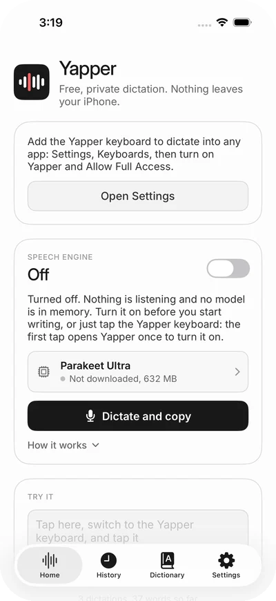 | 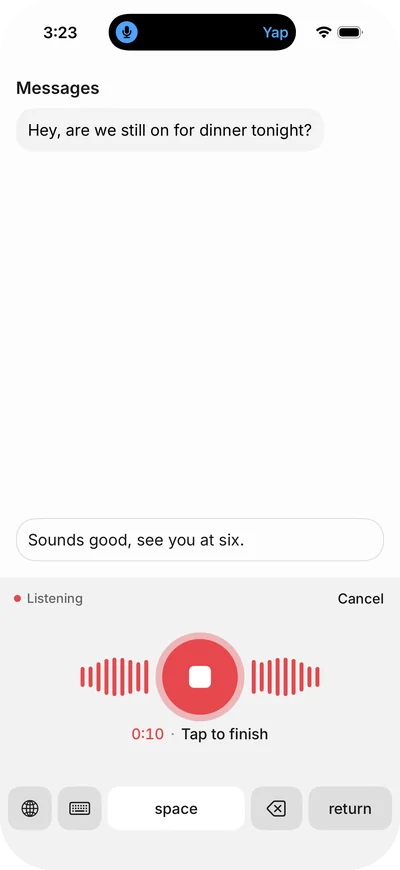 | 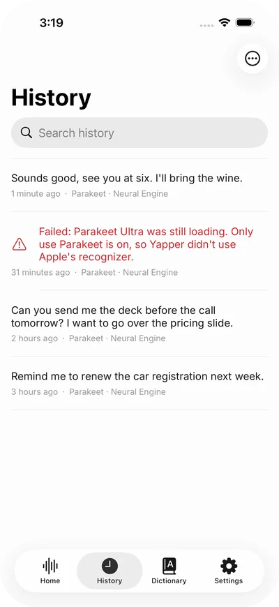 | 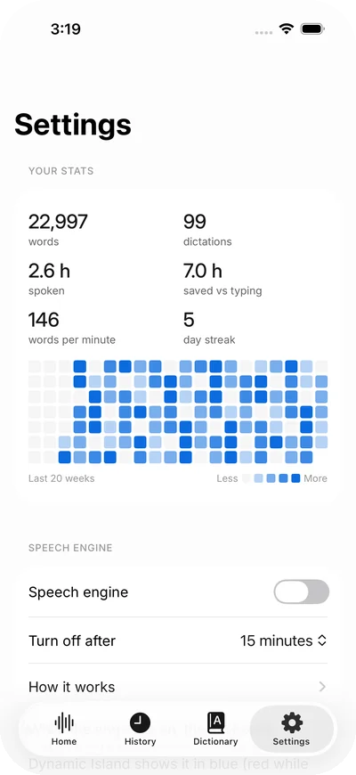 |
| **Speech models** | **Typing layout** | **Onboarding** | **Full Access, explained** |
| 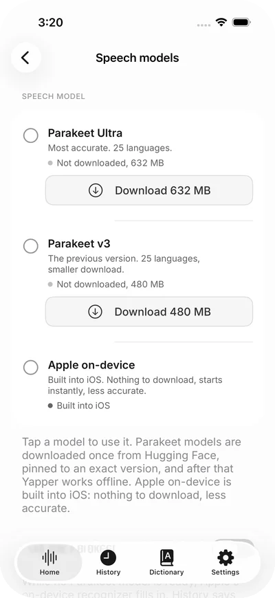 | 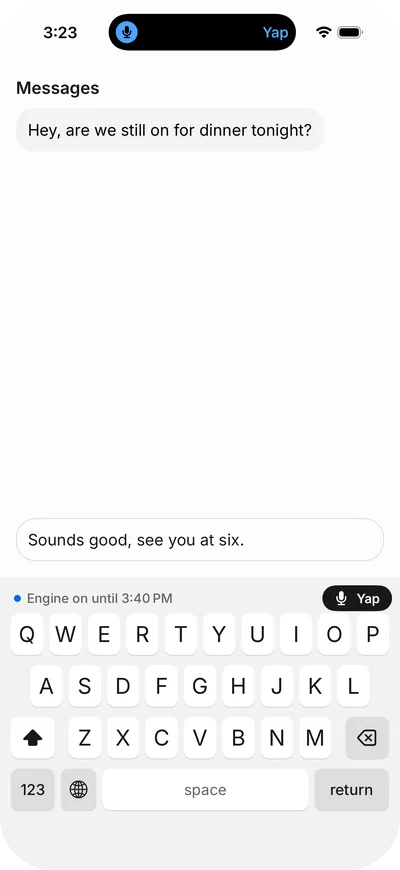 | 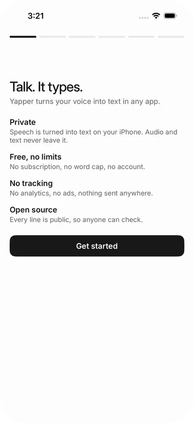 | 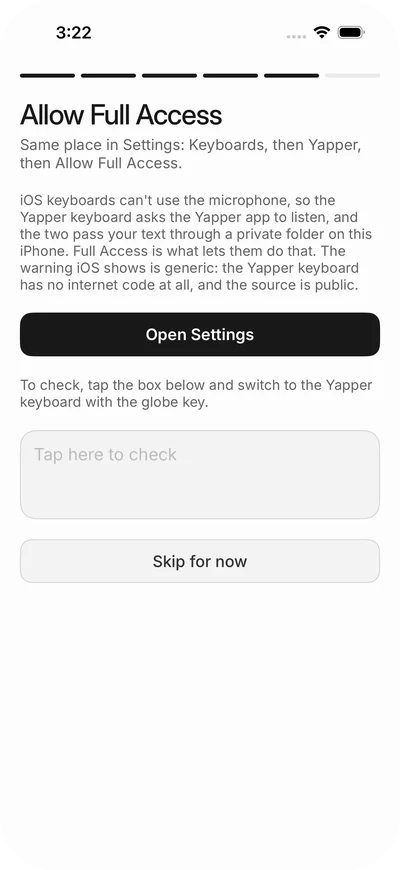 |

<details>
<summary><b>Dark mode</b></summary>

| Home | Listening | History | Stats |
|:---:|:---:|:---:|:---:|
| 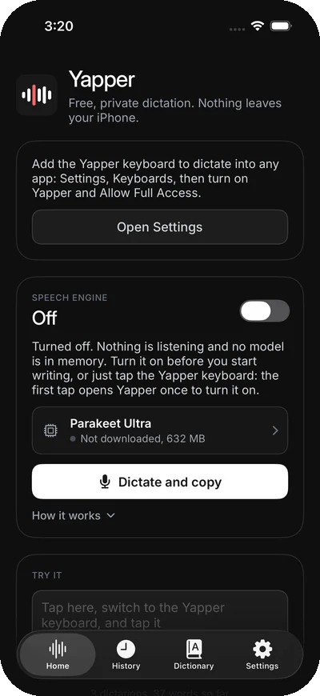 | 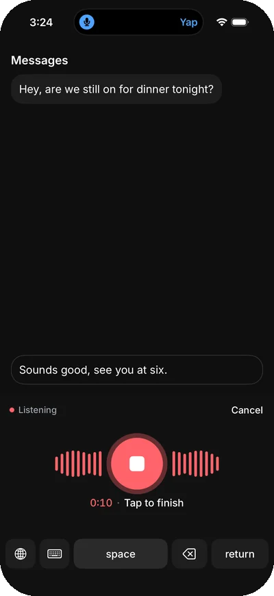 | 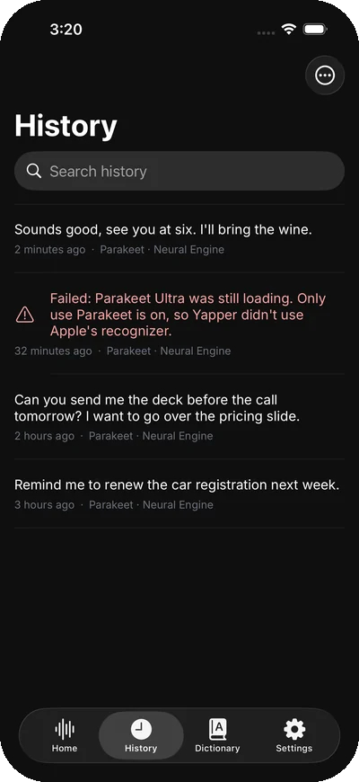 | 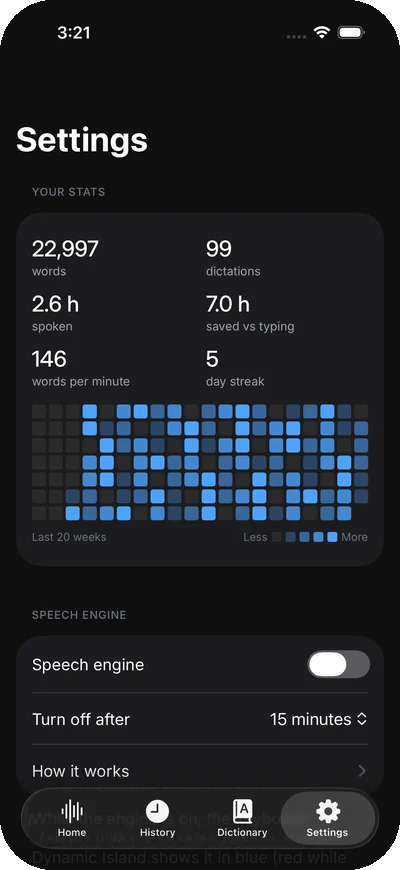 |
| **Speech models** | **Typing layout** | **Onboarding** | **Full Access, explained** |
| 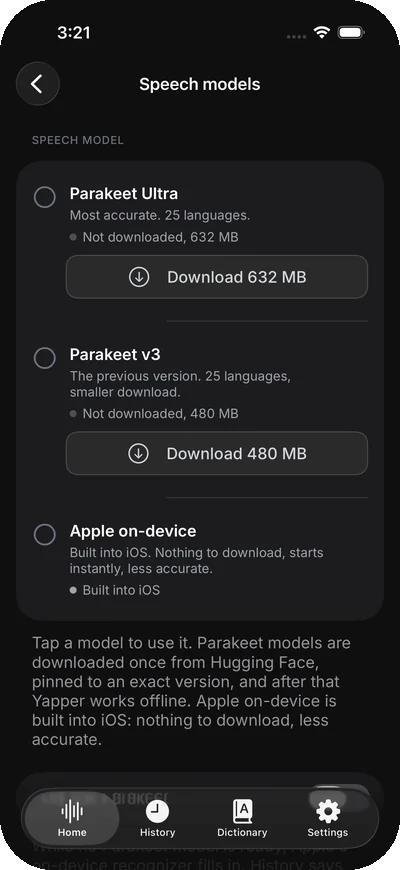 | 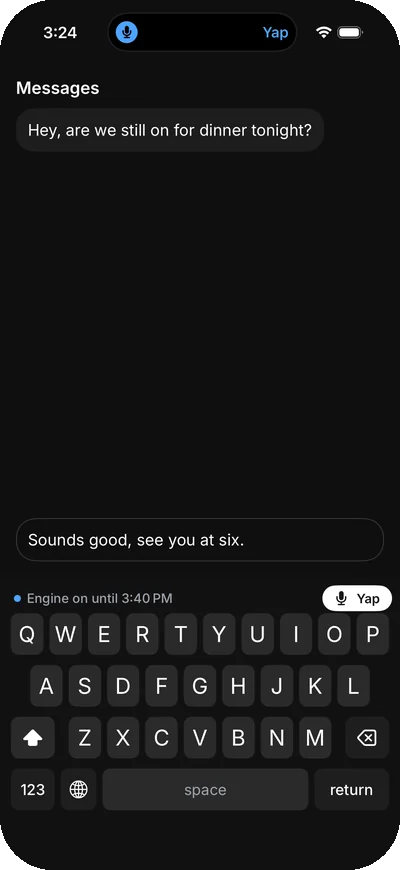 | 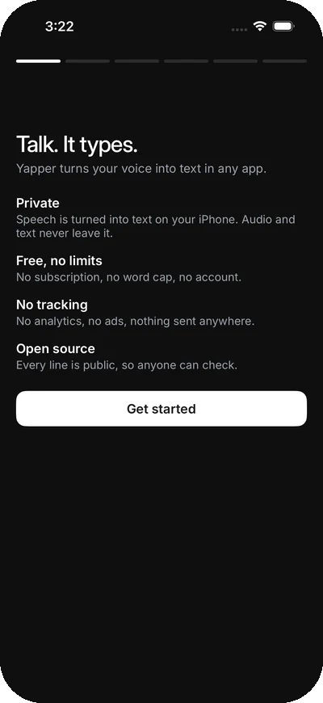 | 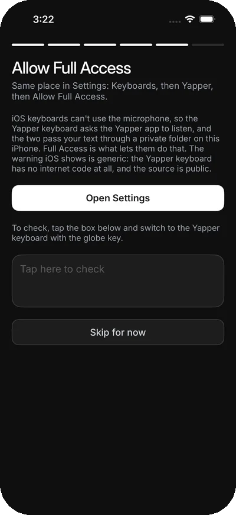 |

</details>

## Install

**App Store:** coming soon. TestFlight isn't public yet; watch this repo for the release.

**Build from source** (Mac with Xcode 26 or newer, [XcodeGen](https://github.com/yonaskolb/XcodeGen), an iPhone on
iOS 18 or newer; speech needs a real device, since the simulator can't run the Neural Engine model):

```sh
git clone https://github.com/justingluska/yapper.git
cd yapper
brew install xcodegen
DEVELOPMENT_TEAM=<your team id> xcodegen generate
open Yapper.xcodeproj
```

To build under your own Apple team, change the bundle IDs (`com.gluska.yapper…`) and the App Group
(`group.com.gluska.yapper`) in `project.yml` and `Shared/Common/Bridge.swift`.

Then on the iPhone: Settings › General › Keyboard › Keyboards › Add New Keyboard › Yapper, and turn on Allow Full
Access. The [support page](https://goldpenguin.org/yapper/support/) walks through it.

## Architecture

| Folder | What's in it |
|---|---|
| `Yapper/` | The app: recording, transcription, the dictation session, onboarding, history, stats, settings |
| `YapperKeyboard/` | The keyboard extension. Never links FluidAudio (extensions get about 50 MB of memory) |
| `YapperWidgets/` | Live Activity (Dynamic Island, Lock Screen) and the Control Center control |
| `Shared/` | Code shared across targets: the keyboard↔app bridge, settings, text cleanup, Yapper's style, App Intents |
| `YapperTests/` | Unit tests for text cleanup |
| `YapperScreenshots/`, `KeyboardScreenshots/`, `KeyboardPreview/` | UI tests that render every screen and keyboard state in CI (never shipped) |
| `project.yml` | XcodeGen spec for every target. The `.xcodeproj` is generated, not committed |

GitHub Actions builds and tests every push ([Build](.github/workflows/build.yml)) and renders screenshots of every
screen in light and dark ([Screenshots](.github/workflows/screenshots.yml)). Releases are built with Xcode Cloud.

## Tech

- **Swift and SwiftUI**, iOS 18+, with a UIKit `UIInputViewController` hosting the keyboard
- **[FluidAudio](https://github.com/FluidInference/FluidAudio)** 0.17.3 to run Parakeet with **Core ML** on the
  Apple Neural Engine (CPU fallback)
- **Parakeet TDT 0.6B** speech models: Parakeet Ultra and Parakeet v3
- **Speech framework** (`SFSpeechRecognizer` with `requiresOnDeviceRecognition`) as the built-in alternative
- **ActivityKit** and **WidgetKit** for the Live Activity and the Control Center control; **App Intents** for Siri,
  Shortcuts and the Action Button
- **AVFoundation** for recording and playback; App Group `UserDefaults` and Darwin notifications for the bridge

## FAQ

<details>
<summary><b>Why does the keyboard open the Yapper app?</b></summary>

iOS doesn't let keyboards use the microphone, so the app does the listening. It only has to open once per session:
after that the engine stays on for the time you picked, and the keyboard dictates in place. Yapper doesn't use
private API to jump back automatically; swipe right along the bottom edge instead.
</details>

<details>
<summary><b>Why is there an orange dot while the engine is on?</b></summary>

That's iOS's microphone indicator, shown whenever any app has the mic open, and no app can change it. Yapper keeps the
mic ready so dictation starts instantly from the keyboard. Turn the engine off in the app, the keyboard or the Dynamic
Island and the dot goes away. The Live Activity shows what's actually happening: blue ready, red listening.
</details>

<details>
<summary><b>Why does it need Full Access?</b></summary>

So the keyboard and the app can pass your text through a private folder on your iPhone. The iOS warning is generic:
the Yapper keyboard has no network code at all, and you can read it in [`YapperKeyboard/`](YapperKeyboard). Without
Full Access, the keyboard still types; it just can't dictate.
</details>

<details>
<summary><b>Why is the first load slow?</b></summary>

The first time a Parakeet model runs, iOS compiles it for your iPhone's Neural Engine, which can take a few minutes,
once. After that it loads in seconds. Until the model is ready, Apple's on-device recognizer does the work, unless you
turn on "Only use Parakeet".
</details>

<details>
<summary><b>Which languages does it understand?</b></summary>

Both Parakeet models cover 25 European languages, including English, and there's no language to pick. Apple's
recognizer uses your iPhone's language. The typing layout is English (QWERTY).
</details>

<details>
<summary><b>Does it work in every app?</b></summary>

Almost. iOS switches to its own keyboard in password fields, and some apps don't allow third-party keyboards. For
those, start a dictation from Control Center, the Action Button or Siri: Yapper copies the text so you can paste it.
</details>

<details>
<summary><b>How much space does it use?</b></summary>

The app itself is small. Parakeet Ultra is a 632 MB download and Parakeet v3 is 480 MB, downloaded only if you choose
them. Apple on-device needs no download.
</details>

## Good to know

Doing dictation on the phone instead of a server has trade-offs. None of them are hidden:

- **Starting takes a moment.** Turning the speech engine on loads the model into the Neural Engine: a few seconds
  usually, and a few minutes the very first time while iOS optimizes it for your chip. Apple on-device starts instantly.
- **It needs space.** Parakeet Ultra is a one-time 632 MB download (Parakeet v3 is 480 MB).
- **Best on recent iPhones.** Parakeet runs best on roughly iPhone 12 and newer, especially models with 6 GB of memory
  or more. Older iPhones work, just slower; Apple on-device is the lighter choice there, and the app says so on
  iPhones with less memory.
- **Yapper opens once per session.** iOS never lets a keyboard use the microphone, so the first dictation opens the
  app to start listening. After that the engine stays on for 5, 15 or 60 minutes.
- **The orange dot and battery.** While the engine is on, iOS shows the mic indicator and the mic stays ready, which
  uses a little more battery. Turn it off from the app, the keyboard or the Dynamic Island.
- **Languages.** Parakeet covers 25 European languages, English included. Apple on-device uses your iPhone's language.
- **Where the keyboard can't go.** iOS uses its own keyboard in password fields, and some apps block other keyboards.
- **It can mishear.** Names, numbers and jargon can come out wrong; the personal dictionary fixes the ones you use.

## Roadmap

Ideas under consideration, all on-device. None of these are promises.

- App Store release
- Voice commands ("new line", "scratch that") and snippets ("my address")
- Vocabulary boosting from the personal dictionary, so names come out right the first time
- Optional polish (self-corrections, lists) with Apple's on-device models, where available
- More typing layouts (AZERTY, QWERTZ, Spanish) and iPad

Ideas and bugs: [open an issue](https://github.com/justingluska/yapper/issues/new/choose).

## Contributing

Contributions are welcome. Read [CONTRIBUTING.md](CONTRIBUTING.md) first: Yapper has a few rules that don't bend (free,
on-device, no network code, a light keyboard). Please follow the [Code of Conduct](CODE_OF_CONDUCT.md), and report
security problems privately as described in [SECURITY.md](SECURITY.md).

## Credits

- **Parakeet Ultra** by [Moondream](https://huggingface.co/moondream/parakeet-ultra) (post-training of NVIDIA Parakeet
  TDT 0.6B v3), [CC BY 4.0](https://creativecommons.org/licenses/by/4.0/); Core ML conversion by
  [FluidInference](https://huggingface.co/FluidInference).
- **Parakeet TDT 0.6B v3** by NVIDIA, [CC BY 4.0](https://creativecommons.org/licenses/by/4.0/); Core ML conversion by
  [FluidInference](https://huggingface.co/FluidInference).
- **FluidAudio** by FluidInference, Apache 2.0.
- **Inter** typeface by Rasmus Andersson, SIL Open Font License 1.1.
- The open-source keyboards whose code and issue trackers taught us how this works, especially
  [Dictus](https://github.com/getdictus/dictus-ios), [KeyVox](https://github.com/macmixing/keyvox) and
  [Muesli](https://github.com/Muesli-HQ/muesli-ios).

## License

[MIT](LICENSE). Made by [Justin Gluska](https://x.com/gluska) and published by Gold Penguin, LLC.
[Website](https://goldpenguin.org/yapper/) · [Privacy](https://goldpenguin.org/yapper/privacy/) ·
[Terms](https://goldpenguin.org/yapper/terms/) · [Support](https://goldpenguin.org/yapper/support/) · team@goldpenguin.org
